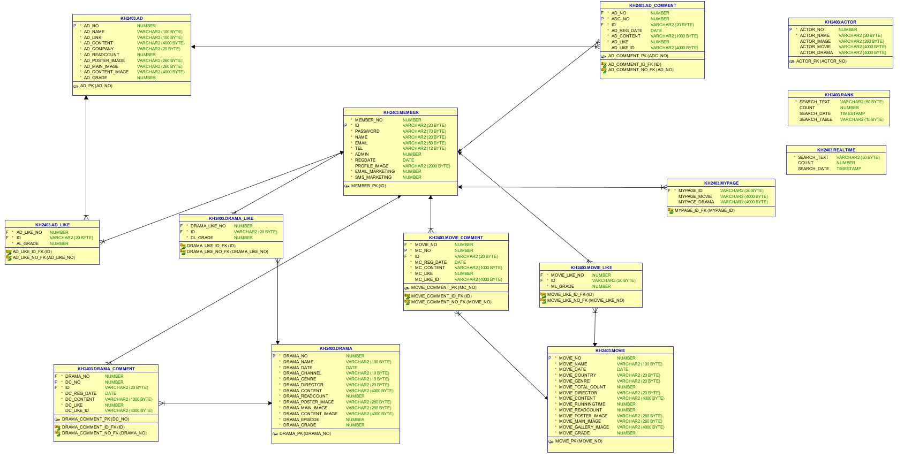
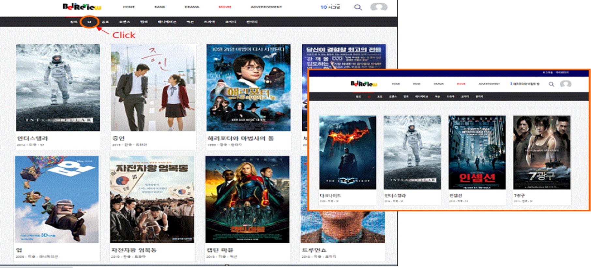
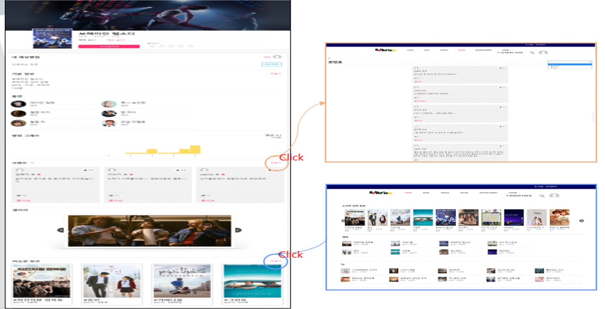
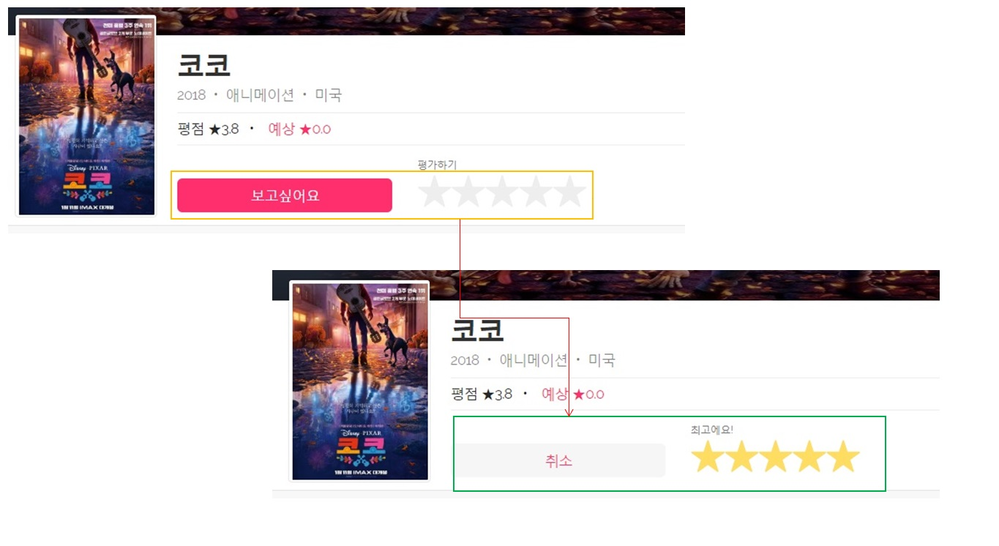
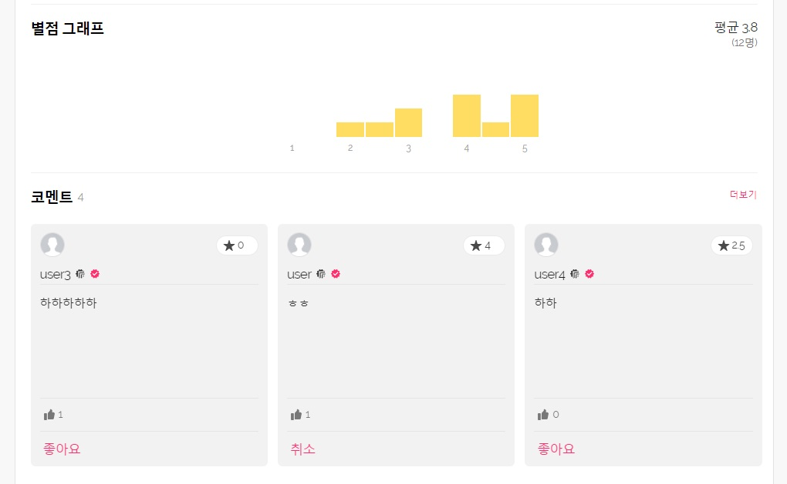
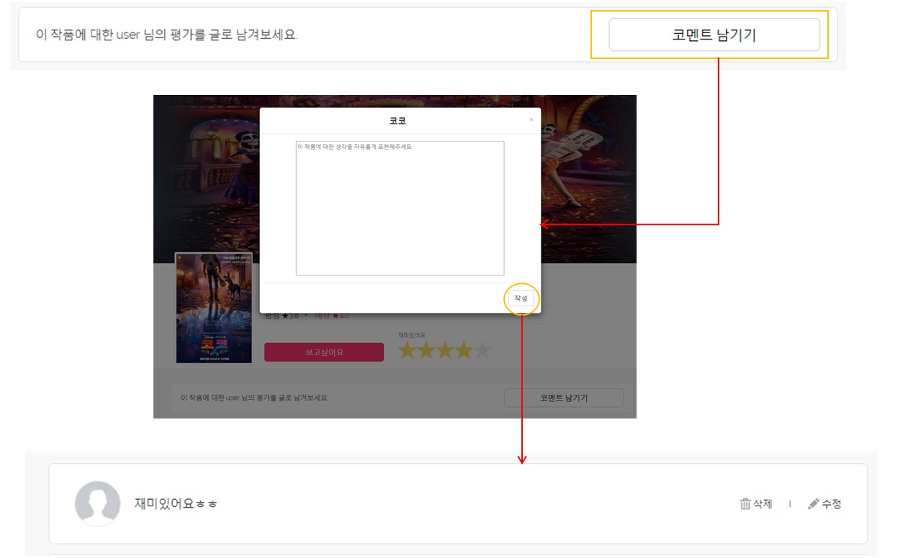
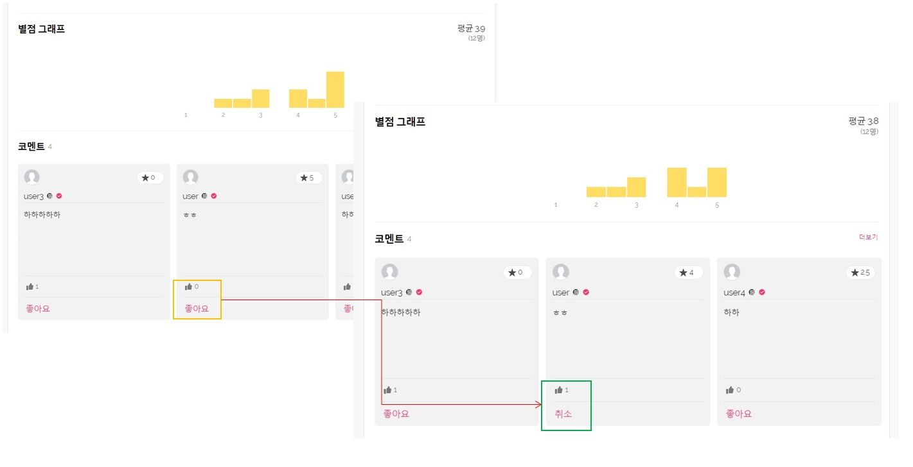
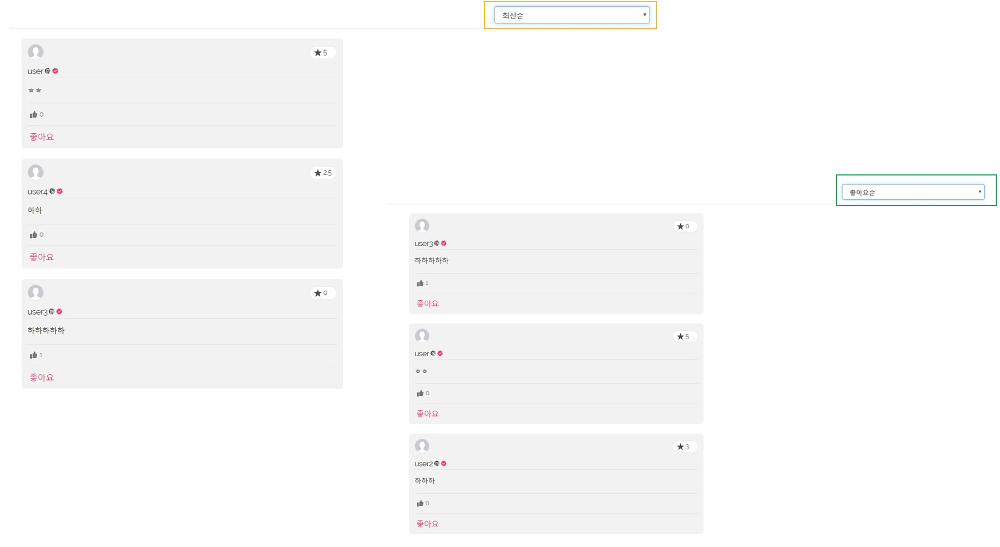
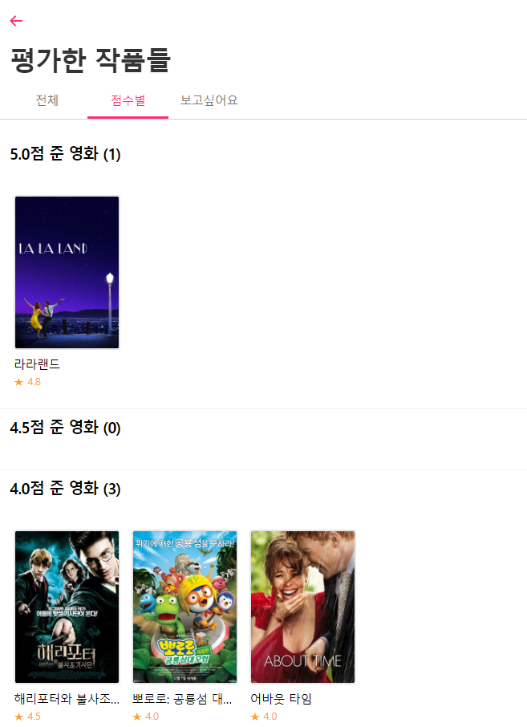

# Belireview

### 개요
* spring framework 및 Ajax , jQuery를 활용한 웹 프로그래밍 실습
* 팀 프로젝트를 통한 팀원들과의 협업 

### 개발 환경
* Language : Java , JSP , javascript , jQuery , CSS , HTML , SQL 
* IDE : Ecilpse 
* Framework : Spring, Mybatis
* Server : Tomcat 9.0
* DBMS : Oracle 11g
* Etc : Git, SourceTree

### 주요 구현 기능
* 회원
   - Ajax를 활용하여 유효성 검사 및 이메일 인증을 통한 회원가입 및 비밀번호 찾기, 비밀번호 암호화
   - 회원정보 수정, 프로필 사진 등록 및 평가한 콘텐츠 리스트 구현
* 콘텐츠
   - 자동완성 기능을 이용한 검색
   - 작품에 대한 평가 및 위시리스트 저장
   - 작품에 대한 코멘트를 작성 및 코멘트에 대한 추천 기능
   - 작품에 대한 회원들의 평점의 비율을 나타낸 별점 분포도

### DB 설계

### 담당역할

리스트 페이지

  
   * 스크롤 이벤트를 사용하여 페이지 로드
     ~~~
  		 $(window).scroll(function(){
					// 현재 브라우저 스크롤 위치 + 브라우저창 길이 + 1 > 현재 보고있는 문서의 길이(현재 보이는 스크롤의 길이)
				if($(window).scrollTop() + $(window).height() + 0.5 > $(document).height()){
					if ($(".list:hidden").length != 0) {  //숨겨진 리스트가 있으면
						//해당 아이디 div 태그 안에 로딩 이미지 추가
						$("#loading").append(""); 
						//0.5초뒤 해당 데이터 보여주고 로딩이미지 삭제
						setTimeout(function(){
							$(".list:hidden").slice(0,8).show();
							$("#loading img").remove();
					}, 500)
				}else{
					return;
				}
			}
     ~~~

상세 페이지

  
   * 작품의 상세정보를 확인할 수 있으며 같은 장르에 해당하는 작품들을 확인할 수 있다.

별점 및 위시리스트

  
   * ajax를 이용하여 데이터를 전송 DB에 값을 추가하고, 값이 이미 존재할 경우 제거하며 해당 결과를 화면에 반영한다.
     ~~~
      별점 스크립트(일부)
      
      rating = $('.gZASBp > a.r10');
          rating.hover(function() {
            $('.gZASBp > div' ).removeClass(initValue).addClass('r10');
          }, function() {
            $('.gZASBp > div' ).removeClass('r10').addClass(initValue);
          });
          rating.click(function(){
            if(initValue == 'r10'){
              initValue = 'r0';
              r=0;
              $('.ccOSgS').html("평가하기");
              rating(r);
            }
            else{
              initValue = 'r10';
              r=5;
              $('.ccOSgS').html("최고에요!");
              rating(r);
            }
          });
     ~~~

별점 분포도

   
   * 회원들의 평가를 종합해 비율을 구하여 해당하는 비율만큼 막대그래프의 높이를 지정한다.
   ~~~
   평점비율(MyBatis)
   
   with tmp as(SELECT '0.5' GRADE, count(*) A FROM movie_like where ML_GRADE=0.5 and movie_like_no=#{MOVIE_NO} UNION ALL
		        SELECT '1' GRADE, count(*) A FROM movie_like where ML_GRADE=1 and movie_like_no=#{MOVIE_NO} UNION ALL
		        SELECT '1.5' GRADE, count(*) A FROM movie_like where ML_GRADE=1.5 and movie_like_no=#{MOVIE_NO} UNION ALL
		        SELECT '2' GRADE, count(*) A FROM movie_like where ML_GRADE=2 and movie_like_no=#{MOVIE_NO} UNION ALL
		        SELECT '2.5' GRADE, count(*) A FROM movie_like where ML_GRADE=2.5 and movie_like_no=#{MOVIE_NO} UNION ALL
		        SELECT '3' GRADE, count(*) A FROM movie_like where ML_GRADE=3 and movie_like_no=#{MOVIE_NO} UNION ALL
		        SELECT '3.5' GRADE, count(*) A FROM movie_like where ML_GRADE=3.5 and movie_like_no=#{MOVIE_NO} UNION ALL
		        SELECT '4' GRADE, count(*) A FROM movie_like where ML_GRADE=4 and movie_like_no=#{MOVIE_NO} UNION ALL
		        SELECT '4.5' GRADE, count(*) A FROM movie_like where ML_GRADE=4.5 and movie_like_no=#{MOVIE_NO} UNION ALL
		        SELECT '5' GRADE, count(*) A FROM movie_like where ML_GRADE=5 and movie_like_no=#{MOVIE_NO}
		  )
		  select 
		    decode(grouping(GRADE),1,'TOTAL',GRADE) as GRADE,
		    TO_CHAR(SUM(A) / SUM(CASE WHEN GROUPING(GRADE) = 0 THEN SUM(A) ELSE 0 END) OVER() * 100, '990.00') AS RATIO
		    FROM tmp
		GROUP BY ROLLUP(GRADE)
   ~~~

코멘트

   
   * ajax를 이용하여 코멘트를 작성하고 폼을 변경한다.
   ~~~
 
     $.ajax({
       async:true,
       type:'POST',
       data:{ID:id,COM:$('.com').val(), MOVIE_NO:<%=request.getParameter("MOVIE_NO")%>},
       url:"<c:url value='/movie/movieDetail.br?${_csrf.parameterName}=${_csrf.token}' />",
       success:function(result){
        $(".writeComment").css("display","none");
        $(".existComment").css("display","block");
        $(".cc").html(result.myCom.MC_CONTENT);
        $(".comen").html(result.comList);
        $(".comnum").html(result.comNum);
       }
     })
	
   ~~~

코멘트 추천 및 정렬

  
   ~~~
     $.ajax({
        async : true,  
        type : 'POST',
        data : {ID:id , COMMENTLIKE:"c" ,CLA:cla , MOVIE_NO:<%=request.getParameter("MOVIE_NO")%>, MC_NO:$(".00"+cla).val()},
        url:"<c:url value='/movie/movieComment.br?${_csrf.parameterName}=${_csrf.token}' />",
        success : function(result){
            var r = result;
            var clike = "좋아요취소";
            var cnolike =  "좋아요";
            if(r.add){
              $('.'+r.CLA).html(clike);
            }
            if(r.subtract){
              $('.'+r.CLA).html(cnolike);
            }
            $('.0'+r.CLA).html(result.MC_LIKE);
        }
      })
   ~~~
  
   ~~~
      $.ajax({
        type : 'POST',
        data : {ID:id,MOVIE_NO:<%=request.getParameter("MOVIE_NO")%>,orderby:$('#orderby').val()},
        url:url,
        success : function(result){
          $('.comen').html(result.commentList);
          var likeList = result.likeList;
          if(likeList.length != 0){
            for(var i=0;i<likeList.length;i++){
              $("."+likeList[i]).html("좋아요취소");
            }					
          }
        }
      })	
   ~~~  

평가한 작품리스트

   

   
  ~~~
   점수별 카테고리jsp(일부)
   
  <c:forEach  var="i" begin="1" end="10" step="1" varStatus="stat">
        <c:set var="rating" value="${((10-i)*0.5)+0.5}"></c:set>
        <c:set var="count" value="0"></c:set>
        <c:forEach items="${userMovieAll}" var="userMovieAll">
          <c:if test="${userMovieAll.ML_GRADE == rating}">
            <input type="hidden" value="${count = count+1}">
          </c:if> 
        </c:forEach>
      <section class="SectionWithHeader__Self-s1eyxltb-0 gAYeFO r${i}">
        

          

            <header class="SectionWithHeader__Header-s1eyxltb-1 cuiACK">
              <h3 class="SectionWithHeader__Title-s1eyxltb-2 kwjefp">${rating}점 준 영화 (${count})</h3>
              
              
            </header>
          

        

  ~~~

기타

 * 인터셉터 적용(비로그인시 url이용 마이페이지 접속 혹은 로그인시 회원가입 및 로그인 페이지 접속시 main으로 redirect)
 ~~~
public class LoginCheckInterceptor extends HandlerInterceptorAdapter{

	@Override
	public boolean preHandle(HttpServletRequest request, HttpServletResponse response, Object handler)
			throws Exception {
		HttpSession session = request.getSession();
		String id = (String) session.getAttribute("ID");
		int admin;
		String uri = request.getRequestURI();
		
		if(id == null || id.trim().length() <= 0 || id == "") {
			if(uri.contains("member")) {
				return true;
			}
			response.sendRedirect("/brw/member/loginForm.br");
			return false;
		}else {
			admin = ((BigDecimal)session.getAttribute("ADMIN")).intValue();
			if(uri.contains("admin")||(uri.contains("member")&&!uri.contains("logout"))) {
				if(admin == 0) {
					response.sendRedirect("/brw/main.br");
					
					return false;
				}
			}
			return true;
		}
	}
}
 ~~~
 * 검색 결과 페이지 구현
 * 버전 관리 시스템 이용 팀원들의 프로젝트 병합 및 수정, 관리

